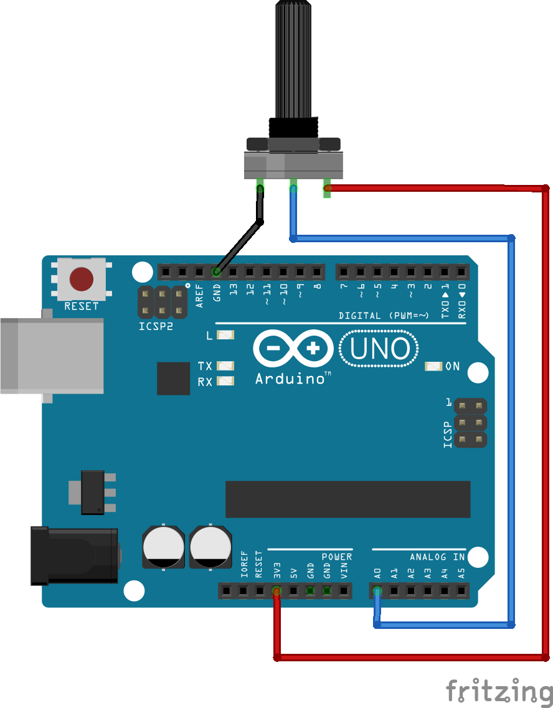

# Potenciômetro com Arduino



Este é um projeto simples de exemplo desenvolvido para demonstrar como lidar com potenciômetros utilizando a plataforma Arduino. Os potenciômetros são componentes úteis em uma variedade de projetos, como controle de velocidade de motores, ajuste de intensidade de luz em LEDs, e muito mais.

## Como Utilizar

1. Conecte os potenciômetros ao Arduino conforme o esquema de circuito fornecido.
2. Carregue o código-fonte do projeto no vscode ou na IDE que você usa.
3. Faça o upload do código para a placa Arduino.
4. Monitore a saída serial para visualizar os valores lidos dos potenciômetros.

## Códigos úteis

Esse projeto está configurado para usar a cli do platformIO.

### Criando os arquivos de configuração para o vscode:

```shell
platformio init --ide vscode
```

### Instalação das Libs de dependências

```shell
pio run
```

### Upload para o arduino

```shell
pio run --target upload
```

### Monitor

```shell
pio device monitor
```

Saiba mais sobre o platformio.io em [platformIO](https://platformio.org/)

Lista de placas para inserir no platformio.ini [boards](https://docs.platformio.org/en/latest/boards/)

## Licença

Este projeto é distribuído sob a licença [MIT](LICENSE), o que significa que você é livre para utilizar, modificar e distribuir o código conforme necessário, desde que inclua a mesma licença nos seus projetos derivados.
